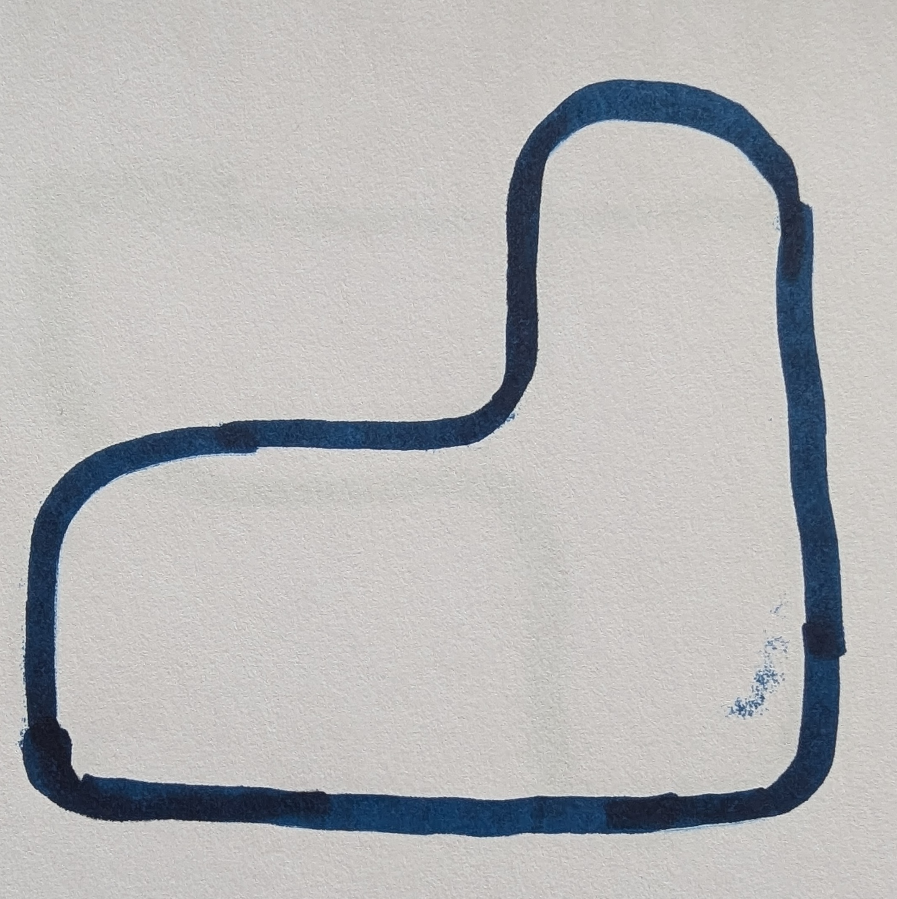

# BitBot XL-workshop

Velkommen til workshop med BitBit XL og micro:bit. Du skal programmere micro:bit-en til å styre bilen. Det er litt fritt program, men vi har laget to "oppgaver" som utgangspunkt for dagens workshop.

# Agenda

## 11:00 Oppstart, del 1

1. Det blir en kort introduksjon til editoren [makecode](https://makecode.microbit.org/), micro:bit og BitBit-en
1. Dere skal lage et enkelt program og overføre til micro:biten.
1. Dere starter på [oppgave 1](./Oppgave_svart-stripe.md) som er å beherske kjøring, svinging og bruk av avstandssensoren til BitBot.

## 12:30 Lunch
Pizza, ispinner og brus

## Ca. 13:00 Del 2

1. [Oppgave 2](./Oppgave_svart-stripe.md) er å bruke svart linje-sensoren til å få bilen til å kjøre langs en svart linje. Det er forskjellige baner med økende vanskelighetsgrad
2. Fri fantasi: Slå deg løs, bruk lys, lyd og andre sensorer til å utforske mulighetene med bilen.
    - Micro:bit-en har lyssensor (v2 av micro:biter har dette). Du kan bruke denne til å slå på lys på bilen hvis den kjører et sted det er mørkt.
    - Micro:biten kan reagere på høy lyd. Kan du få bilen til å stoppe når du klapper? Evt. at den ikke stopper men snurrer rundt og kjører videre i en annen retning.
3. Vi avslutter dagen med en applaus til laget som har fullført den store banen på kortest tid.
